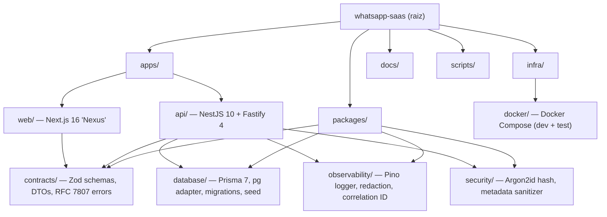
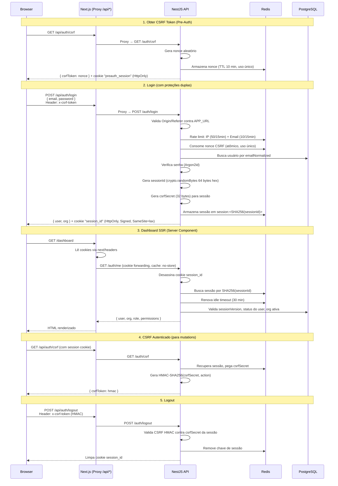
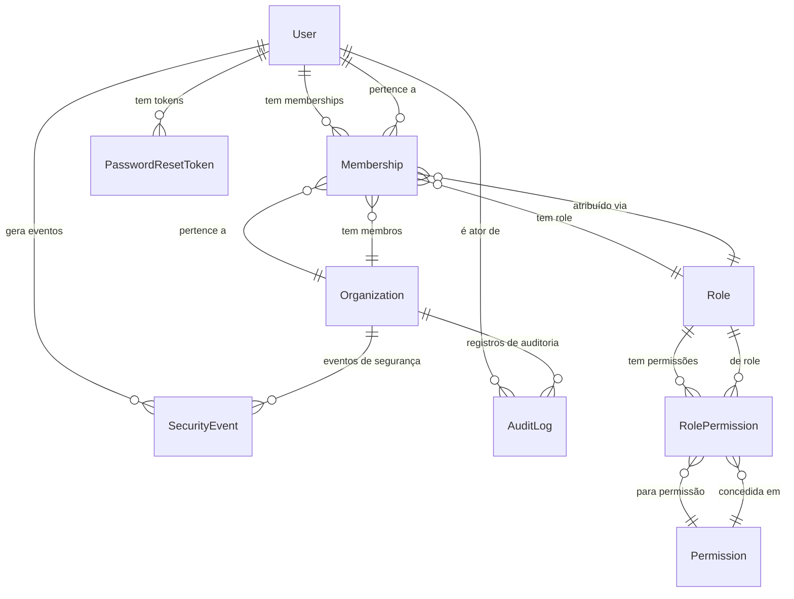
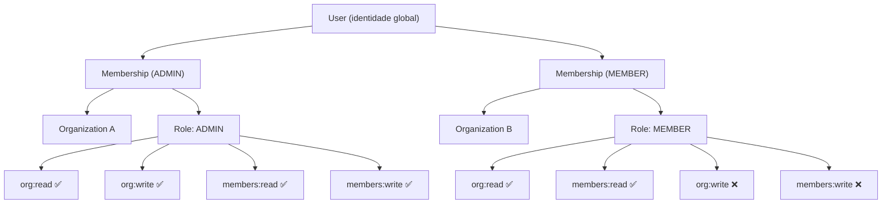
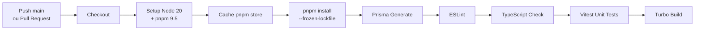

# 📋 Documentação Completa — WhatsApp SaaS Platform ("Nexus")

> [!IMPORTANT]
> Este documento é a **fonte única de verdade** sobre a arquitetura, funcionalidades e estado atual do projeto. Deve ser atualizado a cada marco concluído.

---

## Visão Geral

Plataforma SaaS multi-tenant para gerenciamento de comunicação via WhatsApp Business API (Meta Graph API). Permite que múltiplas organizações conectem números WABA (WhatsApp Business Account), enviem e recebam mensagens, gerenciem contatos, campanhas, templates, funis e equipes — tudo através de uma interface web moderna chamada **"Nexus"**.

O projeto utiliza uma arquitetura de **monorepo** com separação clara entre API backend (NestJS), frontend web (Next.js), e packages compartilhados para database, contratos, segurança e observabilidade.

**Estado Atual**: O projeto está no **Marco 1 (Fundação)** — com identidade, multi-tenancy, RBAC, autenticação completa e dashboard shell implementados. A integração com WhatsApp está planejada para o Marco 4.

---

## Stack Tecnológica

| Camada | Tecnologia | Versão |
|--------|-----------|--------|
| **Backend (API)** | NestJS 10 + Fastify 4 | `@nestjs/platform-fastify` |
| **Frontend (Web)** | Next.js (App Router) + React | Next.js 16.2, React 19.2 |
| **Banco de Dados** | PostgreSQL + Prisma ORM | PostgreSQL 16, Prisma 7.8 |
| **Driver DB** | `@prisma/adapter-pg` + `pg.Pool` | Driver adapter nativo |
| **Cache/Sessões** | Redis (ioredis) | Redis 7 |
| **API Docs** | Swagger / OpenAPI | `@nestjs/swagger` 7.4 |
| **UI Components** | shadcn/ui (Radix UI / Base UI) | shadcn 4.13 |
| **Estilização** | Tailwind CSS | v4 |
| **Validação** | Zod + class-validator | — |
| **State Management** | React Context + Hooks | — |
| **Data Tables** | TanStack React Table | v8.21 |
| **Gráficos** | Recharts | v3.9 |
| **Ícones** | Lucide React | v1.24 |
| **Tema Dark/Light** | next-themes | v0.4.6 (patched para React 19) |
| **Hashing** | Argon2id | memoryCost 64MB, timeCost 3, parallelism 4 |
| **Logging** | Pino + pino-http (via nestjs-pino) | Redação automática de dados sensíveis |
| **Object Storage** | MinIO | S3-compatible |
| **Email (Dev)** | Mailpit | SMTP testing |
| **WhatsApp** | Meta Graph API (planejado) | v21.0, com modo Mock para dev |
| **Monorepo** | pnpm workspaces + Turborepo | pnpm 9.5, Turbo 2 |
| **Testes** | Vitest + Playwright | Vitest 4.1, Playwright 1.61 |
| **CI/CD** | GitHub Actions | Node 20 |

---

## Arquitetura do Monorepo



### Estrutura de Diretórios Completa

```
├── apps/
│   ├── api/                        # Backend NestJS + Fastify
│   │   └── src/
│   │       ├── main.ts             # Bootstrap Fastify + cookies + CORS + Swagger
│   │       ├── app.module.ts       # Módulo raiz
│   │       ├── common/
│   │       │   └── filters/
│   │       │       └── global-exception.filter.ts  # Filtro global de exceções
│   │       ├── config/
│   │       │   ├── env.config.ts        # Validação Zod de env vars
│   │       │   └── openapi.config.ts    # Configuração Swagger/OpenAPI
│   │       ├── health/
│   │       │   ├── health.module.ts
│   │       │   ├── health.controller.ts # Liveness + Readiness probes
│   │       │   └── indicators/
│   │       │       ├── postgres.health.ts  # Sonda PostgreSQL
│   │       │       └── redis.health.ts     # Sonda Redis
│   │       ├── infrastructure/
│   │       │   ├── database/
│   │       │   │   ├── database.module.ts  # Módulo Prisma
│   │       │   │   └── database.service.ts # Wrapper PrismaClient
│   │       │   └── redis/
│   │       │       ├── redis.module.ts
│   │       │       ├── redis.service.ts         # ioredis com proteção FLUSHALL
│   │       │       └── redis-rate-limiter.service.ts # Rate limiter atômico
│   │       └── modules/
│   │           └── identity/
│   │               ├── auth/
│   │               │   ├── auth.module.ts
│   │               │   ├── auth.controller.ts    # CSRF, login, me, logout
│   │               │   ├── auth.service.ts       # Sessões, hashes, CSRF
│   │               │   └── schemas/
│   │               │       └── redis-session.schema.ts  # Schema Zod da sessão
│   │               └── repositories/
│   │                   ├── user.repository.ts
│   │                   ├── organization.repository.ts
│   │                   ├── membership.repository.ts
│   │                   ├── role.repository.ts
│   │                   ├── permission.repository.ts
│   │                   ├── security-event.repository.ts
│   │                   └── audit-log.repository.ts
│   └── web/                        # Frontend Next.js "Nexus"
│       └── src/
│           ├── app/
│           │   ├── layout.tsx      # Root layout (Geist fonts, pt-BR, ThemeProvider)
│           │   ├── page.tsx        # Redireciona para /dashboard
│           │   ├── login/
│           │   │   └── page.tsx    # Login split-screen + CSRF
│           │   ├── dashboard/
│           │   │   ├── layout.tsx  # SSR Auth Guard (fetch /auth/me)
│           │   │   └── page.tsx    # KPIs, gráficos, campanhas
│           │   └── demo/
│           │       ├── form/page.tsx   # Demo de formulários
│           │       └── table/page.tsx  # Demo de TanStack Table
│           ├── components/
│           │   ├── ui/             # 16 primitivos shadcn (Button, Card, etc.)
│           │   ├── ui-custom/      # Componentes de negócio
│           │   │   ├── metric-card.tsx           # KPI cards com trend
│           │   │   ├── dashboard-chart.tsx       # Recharts area chart
│           │   │   ├── data-table.tsx            # TanStack Table wrapper
│           │   │   ├── campaign-progress.tsx     # Progresso de campanha
│           │   │   ├── organization-switcher.tsx # Seletor multi-tenant
│           │   │   ├── page-header.tsx           # Header de página
│           │   │   ├── status-indicator.tsx      # Dots de status
│           │   │   └── empty-state.tsx           # Banner de estado vazio
│           │   ├── layout/         # App Shell
│           │   │   ├── app-shell.tsx       # Layout master
│           │   │   ├── sidebar.tsx         # Sidebar colapsável
│           │   │   ├── header.tsx          # Top navbar
│           │   │   ├── user-menu.tsx       # Avatar + logout
│           │   │   └── layout-context.tsx  # React Context (sidebar, session)
│           │   └── theme/
│           │       ├── theme-provider.tsx  # Wrapper next-themes
│           │       └── theme-toggle.tsx    # Light/Dark/System switcher
│           └── lib/
│               ├── constants.ts           # APP_NAME = "Nexus"
│               ├── internal-api-url.ts    # Server-only API URL
│               └── utils.ts              # cn() tailwind merge
├── packages/
│   ├── contracts/                  # Zod schemas + DTOs + RFC 7807 errors
│   ├── database/                   # Prisma 7 + pg adapter + migrations + seed
│   ├── observability/              # Pino logger + redação + correlation ID
│   └── security/                   # Argon2id + metadata sanitizer
├── infra/docker/
│   ├── docker-compose.yml          # Dev: postgres + redis + minio + mailpit
│   └── docker-compose.test.yml     # Test: postgres-test + redis-test
├── docs/ROADMAP.md
├── scripts/
│   ├── run-dev.mjs
│   ├── run-integration-tests.mjs
│   └── capture-screenshots.mjs
├── artifacts/                      # 23 screenshots (multi-viewport/theme)
├── patches/next-themes@0.4.6.patch
└── .github/workflows/ci.yml
```

---

## 🔗 API — Endpoints Implementados

### Health Checks (`/health`)

| Método | Rota | Auth | Descrição |
|--------|------|------|-----------|
| `GET` | `/health/live` | ❌ | **Liveness Probe** — Retorna `{ status: 'up', timestamp }` |
| `GET` | `/health/ready` | ❌ | **Readiness Probe** — Verifica PostgreSQL e Redis via Terminus. Retorna 200 ou 503 |

### Autenticação (`/auth`)

| Método | Rota | Auth | Descrição |
|--------|------|------|-----------|
| `GET` | `/auth/csrf` | ❌/✅ | CSRF token (pre-auth nonce OU HMAC autenticado) |
| `POST` | `/auth/login` | ❌ | Login com email/senha + CSRF + rate limiting |
| `GET` | `/auth/me` | ✅ | Perfil do usuário autenticado + org ativa |
| `POST` | `/auth/logout` | ✅ | Encerrar sessão (requer CSRF HMAC) |

> [!NOTE]
> A API expõe documentação **Swagger/OpenAPI** (configurada em `openapi.config.ts`).

### Repository Pattern (Acesso a Dados)

| Repositório | Entidade |
|------------|----------|
| `UserRepository` | Operações CRUD de User |
| `OrganizationRepository` | Operações CRUD de Organization |
| `MembershipRepository` | Vínculo User ↔ Organization + Role |
| `RoleRepository` | Roles do RBAC |
| `PermissionRepository` | Permissões granulares |
| `SecurityEventRepository` | Registro de eventos de segurança |
| `AuditLogRepository` | Registro de auditoria (append-only) |

---

## 🔐 Autenticação & Segurança (Detalhado)

### Fluxo de Autenticação Completo



### Modelo de Sessão no Redis

```
Chave: session:<SHA256(sessionId)>
Valor (JSON):
{
  "userId": "uuid",
  "membershipId": "uuid",
  "organizationId": "uuid",
  "sessionVersion": 1,
  "createdAt": "ISO timestamp",
  "lastActivityAt": "ISO timestamp",
  "absoluteExpiresAt": "ISO timestamp",
  "userAgent": "browser user agent",
  "csrfSecret": "32 bytes hex (secreto por sessão)"
}
TTL: SESSION_TTL (default 7 dias / 604800s)
```

### Proteção CSRF — Dois Modos

| Modo | Quando | Mecanismo |
|------|--------|-----------|
| **Pre-Auth Nonce** | Login (usuário anônimo) | Nonce aleatório → Redis (TTL 10min, uso único atômico) → cookie `preauth_session` |
| **HMAC Autenticado** | Mutations logadas (logout, etc.) | HMAC-SHA256(`csrfSecret` da sessão, action) → validado contra header `x-csrf-token` |

### Rate Limiting (Login)

| Dimensão | Limite | Janela | Chave Redis |
|----------|--------|--------|-------------|
| **Por IP** | 50 tentativas | 15 minutos | `rate:login:ip:<hash(ip)>` |
| **Por Email** | 10 tentativas | 15 minutos | `rate:login:email:<hash(email)>` |

> Implementado via `RedisRateLimiterService` com operações atômicas Redis (`INCR` + `EXPIRE` via `multi` pipeline).

### Tabela Completa de Segurança

| Medida | Implementação |
|--------|--------------|
| **Hashing de Senha** | Argon2id (64MB memória, 3 iterações, 4 threads) + `needsRehash()` |
| **Session ID** | `crypto.randomBytes(64)` hex (128 chars) |
| **Session Storage** | `session:<SHA256(sessionId)>` no Redis |
| **Session Versioning** | `sessionVersion` no User invalida todas as sessões |
| **Idle Timeout** | 30 minutos (renovado a cada request válido) |
| **Absolute Expiry** | 7 dias fixos a partir do login |
| **CSRF Pre-Auth** | Nonce atômico uso-único no Redis (10min TTL) |
| **CSRF Autenticado** | HMAC-SHA256 com `csrfSecret` por sessão |
| **Rate Limiting** | Dual: IP (50/15min) + Email (10/15min) via Redis atômico |
| **Origin Validation** | Valida `Origin`/`Referer` contra `APP_URL` no login |
| **Cookie Security** | HttpOnly, Signed, SameSite=lax, Secure em produção |
| **Redis Protection** | `FLUSHALL` bloqueado no RedisService |
| **Log Redaction** | Pino auto-redact: authorization, cookies, passwords, tokens, DB URLs |
| **Metadata Sanitizer** | Recursive denylist, anti-circular, max depth 5, max keys 100, max 10KB |
| **Audit Trail** | AuditLog append-only (trigger PL/pgSQL bloqueia UPDATE/DELETE) |
| **Security Events** | Registro com severidade, IP mascarado/hashado, correlationId |
| **Soft Delete** | `deletedAt` em User e Organization |
| **Password Reset** | Tokens SHA-256 hashados, single-use, com expiração |
| **MFA Ready** | Flag `mfaEnabled` preparada no schema |
| **Error Handling** | GlobalExceptionFilter oculta stack em prod, inclui correlationId |

---

## 🗄️ Modelo de Dados (Prisma 7 Schema)

### Diagrama de Entidades



### Modelos Detalhados

#### `User` (tabela: `users`)
| Campo | Tipo | Descrição |
|-------|------|-----------|
| `id` | UUID (gen_random_uuid) | Identificador único |
| `email` | VarChar(320) | Email (check constraint: `email = lower(trim(email))`) |
| `emailNormalized` | VarChar(320), unique | Email normalizado (lowercase) |
| `passwordHash` | String | Hash Argon2id da senha |
| `name` | String | Nome completo |
| `status` | Enum UserStatus | PENDING_VERIFICATION, ACTIVE, INACTIVE, SUSPENDED |
| `platformRole` | Enum PlatformRole? | SUPER_ADMIN (nível sistema) |
| `sessionVersion` | Int (default 1) | Contador para invalidação global de sessões |
| `mfaEnabled` | Boolean (default false) | Flag de autenticação multifator |
| `emailVerifiedAt` | DateTime? | Data de verificação do email |
| `deletedAt` | DateTime? | Soft delete |
> Índices: `[status, deletedAt]`

#### `Organization` (tabela: `organizations`)
| Campo | Tipo | Descrição |
|-------|------|-----------|
| `id` | UUID | Identificador único |
| `name` | String | Nome da organização |
| `slug` | String, unique | Identificador URL-friendly (check: `^[a-z0-9-]+$`) |
| `status` | Enum OrgStatus | ACTIVE, INACTIVE, SUSPENDED |
| `deletedAt` | DateTime? | Soft delete |
> Índices: `[status, deletedAt]`

#### `Role` (tabela: `roles`)
| Campo | Tipo | Descrição |
|-------|------|-----------|
| `id` | UUID | Identificador único |
| `code` | String, unique | Código do role (ADMIN, MEMBER, VIEWER) |
| `name` | String | Nome de exibição |
| `description` | String? | Descrição |

#### `Permission` (tabela: `permissions`)
| Campo | Tipo | Descrição |
|-------|------|-----------|
| `id` | UUID | Identificador único |
| `key` | String, unique | Chave (ex: `org:read`, `org:write`, `members:read`, `members:write`) |
| `name` | String | Nome de exibição |
| `description` | String? | Descrição |

#### `RolePermission` (tabela: `role_permissions`)
- PK composta: `[roleId, permissionId]`
- Cascade delete em ambas FKs

#### `Membership` (tabela: `memberships`)
| Campo | Tipo | Descrição |
|-------|------|-----------|
| `id` | UUID | Identificador único |
| `organizationId` | FK → Organization (Restrict) | Organização |
| `userId` | FK → User (Restrict) | Usuário |
| `roleId` | FK → Role (Restrict) | Role atribuído |
| `status` | Enum MembershipStatus | ACTIVE, INACTIVE, SUSPENDED |
| `themePreference` | Enum ThemePreference | LIGHT, DARK, SYSTEM (default: SYSTEM) |
> Unique: `[organizationId, userId]`
> Índices: `[organizationId, status]`, `[userId, status]`, `[roleId]`

#### `PasswordResetToken` (tabela: `password_reset_tokens`)
| Campo | Tipo | Descrição |
|-------|------|-----------|
| `id` | UUID | Identificador único |
| `userId` | FK → User (Cascade) | Usuário |
| `tokenHash` | VarChar(64), unique | Token SHA-256 hashado |
| `expiresAt` | DateTime | Data de expiração |
| `usedAt` | DateTime? | Single-use: marcado ao usar |
> Índices: `[userId, expiresAt]`, `[expiresAt]`, `[usedAt]`

#### `SecurityEvent` (tabela: `security_events`)
| Campo | Tipo | Descrição |
|-------|------|-----------|
| `id` | UUID | Identificador único |
| `eventType` | String | Tipo do evento |
| `severity` | Enum Severity | INFO, WARNING, CRITICAL |
| `ipAddressMasked` | String? | IP parcialmente mascarado |
| `ipAddressHash` | String? | Hash do IP para correlação |
| `userAgent` | String? | User agent |
| `userId` | FK → User? (SetNull) | Usuário |
| `organizationId` | FK → Organization? (SetNull) | Organização |
| `metadata` | JSONB? | Dados extras |
| `occurredAt` | DateTime | Timestamp |
> Índices: `[organizationId, occurredAt]`, `[userId, occurredAt]`, `[eventType, occurredAt]`, `[severity, occurredAt]`

#### `AuditLog` (tabela: `audit_logs`)
| Campo | Tipo | Descrição |
|-------|------|-----------|
| `id` | UUID | Identificador único |
| `action` | String | Ação realizada |
| `entityType` | String | Tipo da entidade |
| `entityId` | String | ID da entidade |
| `organizationId` | FK → Organization (Restrict) | Organização |
| `actorUserId` | FK → User? (SetNull) | Ator |
| `metadata` | JSONB? | Dados extras |
| `correlationId` | String? | ID de correlação cross-request |
| `occurredAt` | DateTime | Timestamp |
> Índices: `[organizationId, occurredAt]`, `[actorUserId, occurredAt]`, `[entityType, entityId]`, `[correlationId]`

> [!IMPORTANT]
> **Append-Only**: Trigger PL/pgSQL `trg_audit_logs_append_only` **bloqueia UPDATE e DELETE** a nível de banco de dados.

### Enums

| Enum | Valores |
|------|---------|
| `PlatformRole` | SUPER_ADMIN |
| `UserStatus` | PENDING_VERIFICATION, ACTIVE, INACTIVE, SUSPENDED |
| `OrganizationStatus` | ACTIVE, INACTIVE, SUSPENDED |
| `MembershipStatus` | ACTIVE, INACTIVE, SUSPENDED |
| `ThemePreference` | LIGHT, DARK, SYSTEM |
| `SecurityEventSeverity` | INFO, WARNING, CRITICAL |

---

## 🖥️ Frontend — Páginas e Funcionalidades

### Nome do App: **Nexus**

### Páginas Implementadas

| Rota | Proteção | Descrição |
|------|----------|-----------|
| `/` | Pública | Redireciona para `/dashboard` |
| `/login` | Pública | Login split-screen: branding banner à esquerda + form com CSRF à direita |
| `/dashboard` | SSR Auth Guard | KPIs (metric cards com trend), gráfico de atividade (Recharts area), campanhas ativas, status de conexão, alerta de templates Meta |
| `/demo/form` | Pública | Showcase de componentes de formulário (validação, estados) |
| `/demo/table` | Pública | Showcase de TanStack Table (avatars, status, badges, paginação, skeletons) |

### Rotas Planejadas (definidas na sidebar)

| Rota | Propósito |
|------|-----------|
| `/inbox` | Atendimento (chat com clientes) |
| `/campaigns` | Gerenciamento de campanhas |
| `/contacts` | Gerenciamento de contatos |
| `/templates` | Templates de mensagem (HSM) |
| `/flows` | Fluxos de automação (chatbot) |
| `/reports` | Relatórios e analytics |
| `/connections` | Conexões WABA |
| `/users` | Gerenciamento de usuários |
| `/settings` | Configurações da organização |

### Hierarquia de Layout

```
RootLayout (Geist fonts, lang="pt-BR")
 └── ThemeProvider (next-themes)
      └── DashboardLayout (Server Component — SSR fetch /auth/me)
           └── AppShell
                └── LayoutProvider (Context: sidebar, session, user, org)
                     ├── Sidebar (navegação colapsável)
                     │    ├── Links: Dashboard, Inbox, Campaigns, Contacts...
                     │    └── Indicadores de status
                     └── Main Content
                          ├── Header
                          │    ├── OrganizationSwitcher (troca de tenant)
                          │    ├── Global Search Input
                          │    ├── Notifications Bell
                          │    ├── ThemeToggle (Light/Dark/System)
                          │    └── UserMenu (avatar, org name, logout com CSRF)
                          └── <main>{children}</main>
```

### Design System

| Aspecto | Detalhes |
|---------|---------|
| **Fontes** | Geist Sans (primary), Geist Mono (code/números) |
| **Paleta Light** | Background `#F5F7FB`, Surface `#FFFFFF`, Primary Indigo `#4F46E5` |
| **Paleta Dark** | Background `#0B1120`, Card `#111827`, Primary Light Indigo `#818CF8` |
| **Tema** | CSS custom properties HSL + `.dark` class via next-themes |
| **Componentes UI (16)** | Avatar, Badge, Button, Card, Checkbox, Dropdown Menu, Input, Label, Progress, Select, Sheet, Skeleton, Switch, Table, Textarea, Tooltip |
| **Componentes Custom (8)** | MetricCard, DashboardChart, DataTable, EmptyState, CampaignProgress, OrganizationSwitcher, PageHeader, StatusIndicator |

### Integração com API

| Contexto | Método | Detalhes |
|----------|--------|---------|
| **Server Components** | `fetch()` nativo | URL: `INTERNAL_API_URL`, cookie forwarding via `next/headers`, `cache: 'no-store'` |
| **Client Components** | `fetch()` nativo | URL: `/api/*` (Next.js rewrite → backend), `credentials: "include"` |
| **CSRF (Client)** | Double-submit | `GET /api/auth/csrf` → header `x-csrf-token` em mutations |

---

## 🏢 Multi-Tenancy & RBAC



- **Shared Database**: Todas as organizações compartilham o mesmo banco
- **Contexto de Tenant**: Determinado no login via `Membership`, armazenado na sessão Redis (`organizationId`, `membershipId`)
- **RBAC granular**: Role → RolePermission → Permission
- **Roles padrão**: ADMIN (acesso total), MEMBER (leitura/escrita limitada), VIEWER (somente leitura)
- **Multi-org**: Um usuário pode pertencer a múltiplas organizações com roles diferentes
- **SUPER_ADMIN**: Role de plataforma (`platformRole`) para administração do sistema

---

## 📦 Packages Compartilhados

### `@repo/contracts`

| Arquivo | Conteúdo |
|---------|----------|
| `errors.ts` | `ProblemDetailsSchema` — Formato RFC 7807 para erros padronizados |
| `health.ts` | `HealthStatusSchema` (up/down/degraded), `ReadinessStatusSchema` (com dependências) |
| `schemas.ts` | Enums Zod, DTOs de resposta (omitem campos sensíveis), Paginação, Auth DTOs |

> [!TIP]
> DTOs de resposta como `UserSummarySchema` **omitem** `passwordHash`, `platformRole`, `sessionVersion`, `deletedAt` — campos internos nunca vazam para o frontend.

### `@repo/security`

| Módulo | Funções |
|--------|---------|
| `hash.ts` | `hashPassword()` — Argon2id (64MB, 3 iter, 4 threads) |
| | `verifyPassword()` — Verificação segura |
| | `needsRehash()` — Detecta necessidade de re-hash |
| `sanitizer.ts` | `sanitizeMetadata(obj)` — Sanitiza recursivamente objetos |
| | Denylist: password, token, authorization, cookie, session, secret, accesstoken, refreshtoken, databaseurl, redisurl |
| | Proteções: circular refs → `[CIRCULAR]`, max depth 5, max keys 100, max 10KB |

### `@repo/observability`

| Módulo | Funções |
|--------|---------|
| `logger.ts` | `createLogger(name, level)` — Pino com redação automática (authorization, cookies, passwords, tokens, DB URLs) |
| `correlation.ts` | `ensureCorrelationId(id?)` — Gera/valida UUID v4 para correlação cross-request (usado em `AuditLog.correlationId`) |

### `@repo/database`

| Módulo | Funções |
|--------|---------|
| `adapter.ts` | `createPrismaClient(connectionString)` — Factory via `pg.Pool` + `@prisma/adapter-pg` |
| `index.ts` | Re-exporta client, types, e enums Prisma |
| `prisma/seed.ts` | Seed com validação Zod de env vars, upsert de 3 roles + 4 permissions + admin + org |

---

## 🏗️ Infraestrutura

### Docker Compose — Desenvolvimento

Utiliza **Docker profiles** para controle seletivo:

| Serviço | Imagem | Porta | Profile | RAM Max |
|---------|--------|-------|---------|---------|
| **PostgreSQL** | `postgres:16-alpine` | 5432 | core, full | 512MB |
| **Redis** | `redis:7-alpine` (AOF) | 6379 | core, full | 256MB |
| **MinIO** | `quay.io/minio/minio` | 9000 (API), 9001 (Console) | media, full | 256MB |
| **MinIO Setup** | `quay.io/minio/mc` | — | media, full | Auto-cria bucket + user |
| **Mailpit** | `axllent/mailpit` | 1025 (SMTP), 8025 (Web UI) | mail, full | 128MB |

```bash
pnpm infra:start       # Profile core: PostgreSQL + Redis
pnpm infra:start:full  # Profile full: Todos os serviços
pnpm infra:stop        # Para todos
```

**Rede**: `whatsapp-saas-network` (custom Docker network)

**MinIO Setup automático**:
- Cria bucket `whatsapp-media` com política `download`
- Provisiona user `whatsapp_app` com acesso `s3:*` ao bucket

### Docker Compose — Testes

| Serviço | Porta | DB/User |
|---------|-------|---------|
| `postgres-test` | 127.0.0.1:5433 | `whatsapp_test` / `user` |
| `redis-test` | 127.0.0.1:6380 | — |

### Variáveis de Ambiente

<details>
<summary><strong>Clique para expandir todas as variáveis</strong></summary>

| Categoria | Variável | Descrição | Default |
|-----------|----------|-----------|---------|
| **App** | `NODE_ENV` | Ambiente | development |
| | `APP_ENV` | Ambiente do app | local |
| | `API_PORT` | Porta da API | 3333 |
| | `APP_URL` | URL do frontend | http://localhost:3000 |
| | `NEXT_PUBLIC_API_URL` | API URL (client-side) | http://localhost:3333 |
| | `INTERNAL_API_URL` | API URL (server-side SSR) | http://localhost:3333 |
| | `CORS_ORIGINS` | Origens CORS | http://localhost:3000 |
| **Database** | `DATABASE_URL` | PostgreSQL connection string | — |
| **Redis** | `REDIS_URL` | Redis connection string | redis://localhost:6379 |
| | `REDIS_URL_TEST` | Redis de teste | redis://localhost:6380 |
| **Segurança** | `SESSION_SECRET` | Chave HMAC sessões | (32+ bytes) |
| | `SESSION_COOKIE_SECRET` | Assinatura do cookie | (32+ bytes) |
| | `CSRF_HMAC_SECRET` | HMAC para CSRF autenticado | (32+ bytes) |
| | `CSRF_SECRET` | Secret CSRF adicional | (32+ bytes) |
| | `CREDENTIAL_ENCRYPTION_KEY` | Encriptação de credenciais | (32+ bytes) |
| | `PASSWORD_RESET_SECRET` | Secret para reset de senha | (32+ bytes) |
| | `SESSION_TTL` | TTL da sessão | 604800 (7 dias) |
| **Storage** | `STORAGE_PROVIDER` | Provider | minio / local |
| | `MINIO_ENDPOINT` | Endpoint MinIO | localhost |
| | `MINIO_PORT` | Porta MinIO | 9000 |
| | `MINIO_ACCESS_KEY` | Chave de acesso | whatsapp_app |
| | `MINIO_BUCKET` | Bucket padrão | whatsapp-media |
| **WhatsApp** | `WHATSAPP_PROVIDER_MODE` | Modo do provider | MOCK |
| | `META_GRAPH_API_VERSION` | Versão Graph API | v21.0 |
| | `META_APP_ID` | App ID Meta | — |
| | `META_APP_SECRET` | App Secret Meta | — |
| | `META_WABA_ID` | WABA ID | — |
| | `META_PHONE_NUMBER_ID` | Phone Number ID | — |
| | `META_ACCESS_TOKEN` | Token de acesso | — |
| | `META_WEBHOOK_VERIFY_TOKEN` | Token webhook | — |
| **Mock** | `MOCK_ACCEPTANCE_RATE` | Taxa aceitação | 0.98 |
| | `MOCK_DELIVERY_RATE` | Taxa entrega | 0.95 |
| | `MOCK_READ_RATE` | Taxa leitura | 0.70 |
| | `MOCK_REPLY_RATE` | Taxa resposta | 0.15 |
| | `MOCK_FAILURE_RATE` | Taxa falha | 0.02 |
| | `MOCK_MIN_DELAY_MS` | Delay mínimo | 500 |
| | `MOCK_MAX_DELAY_MS` | Delay máximo | 5000 |
| **Observabilidade** | `LOG_LEVEL` | Nível de log | debug |
| | `LOG_RETENTION_DAYS` | Retenção de logs | 30 |
| | `UPLOAD_MAX_SIZE` | Upload máximo | 16777216 (16MB) |
| | `DEFAULT_TIMEZONE` | Timezone | America/Sao_Paulo |

</details>

---

## 🧪 Testes

| Tipo | Framework | Config | Localização |
|------|-----------|--------|-------------|
| **Unit** | Vitest | padrão | `apps/api/`, `apps/web/`, `packages/security/` |
| **Integration** | Vitest | `vitest.config.integration.ts` | `apps/api/` |
| **E2E** | Vitest | `vitest.config.e2e.ts` | `apps/api/` |
| **Frontend E2E** | Playwright | `playwright.config.ts` | `apps/web/` |
| **Visual** | Playwright (script) | `capture-screenshots.mjs` | 23 PNGs em `artifacts/` |

### Comandos
```bash
pnpm test                       # Unit tests (Turbo, todos)
pnpm test:integration:local     # Integration (setup Docker automático)
pnpm --filter @repo/api test    # Unit tests API only
```

### Screenshots Automatizados
- Rotas: `/dashboard`, `/login`
- Modos: light + dark
- Viewports: 1440x900 (desktop), 390x844 (mobile), 768x1024 (tablet)
- Estados: sidebar expandida + colapsada

---

## 🔄 CI/CD (GitHub Actions)



---

## 🗺️ Roadmap do Projeto

| Marco | Nome | Status | Destaques |
|-------|------|--------|-----------|
| **1** | Fundação do Backend | ✅ Completo | Monorepo, User/Org/Membership, RBAC (Role+Permission), sessões Redis, CSRF dual, rate limiting, audit logs append-only, security events, health checks |
| **2** | Dashboard & UI Shell | ✅ Completo | Next.js 16 app shell, sidebar, header, theme toggle, KPI cards, Recharts, TanStack Table, SSR auth guard, org switcher |
| **3** | Storage & Email | 🟡 Parcial | MinIO configurado (bucket + user), Mailpit para dev |
| **4** | Meta WhatsApp API | ⬜ Pendente | Integração Graph API v21.0, webhooks Meta, templates HSM, instâncias WABA, modo Mock |
| **5** | CRM & Automação | ⬜ Pendente | Contatos, conversas, funis, tags, quick replies, chatbot flows |
| **6** | Analytics & Billing | ⬜ Pendente | KPIs reais, relatórios, Stripe, limites de plano |

### Itens Pendentes Detalhados

**Segurança (pré-produção):**
- [ ] Headers `Retry-After` e `X-RateLimit-*` em respostas 429
- [ ] Validação strict de `Origin`/`Referer` em produção
- [ ] Avaliar `SameSite=strict` vs `lax` para session cookies
- [ ] CSRF protection para todas as mutations autenticadas
- [ ] `GET /auth/sessions` — listar sessões ativas
- [ ] `DELETE /auth/sessions/:id` — revogar sessão individual

**Database:**
- [ ] Índice composto `User(emailNormalized, organizationId)`
- [ ] PgBouncer connection pooling para produção

**Frontend:**
- [ ] Global toast error handling
- [ ] Dashboard loading states
- [ ] Implementar rotas planejadas (inbox, campaigns, contacts, etc.)

**DevOps:**
- [ ] Multi-stage Dockerfile para deploy da API
- [ ] Secrets management (Vault / AWS SSM)

---

## 🔑 Dados de Seed

Configurável via variáveis de ambiente (validadas com Zod):

| Variável | Descrição |
|----------|-----------|
| `SEED_ADMIN_EMAIL` | Email do admin inicial |
| `SEED_ADMIN_PASSWORD` | Senha (hashada com Argon2id) |
| `SEED_ORGANIZATION_NAME` | Nome da org demo |
| `SEED_ORGANIZATION_SLUG` | Slug da org demo |

**O seed cria:**
- 3 Roles: ADMIN, MEMBER, VIEWER
- 4 Permissions: `org:read`, `org:write`, `members:read`, `members:write`
- Role-Permission mappings
- 1 Organization (upsert)
- 1 User admin (upsert)
- 1 Membership (admin → org com role ADMIN)

---

## 📝 Notas para Desenvolvimento

> [!TIP]
> **Padrão para novos módulos API**: Criar dentro de `src/modules/<domain>/` seguindo Module + Controller + Service + Repository. Usar schemas Zod de `@repo/contracts` para validação. Registrar ações no `AuditLog` com `correlationId` de `@repo/observability`. Sanitizar metadata com `@repo/security`.

> [!TIP]
> **Validação de env vars**: Toda nova variável de ambiente deve ser adicionada ao schema Zod em `config/env.config.ts` — a API falha no bootstrap se variáveis obrigatórias estiverem ausentes.

> [!NOTE]
> **WhatsApp Mock Mode**: O `WHATSAPP_PROVIDER_MODE=MOCK` permite desenvolvimento completo sem custos da Meta API. O mock engine simula taxas realistas de aceitação (98%), entrega (95%), leitura (70%), resposta (15%) e falha (2%) com delays configuráveis.

> [!NOTE]
> **Next.js API Proxy**: O frontend usa rewrite rules (`/api/:path*` → `INTERNAL_API_URL/:path*`) para evitar CORS em client-side requests. Server Components chamam a API diretamente via `INTERNAL_API_URL`.
